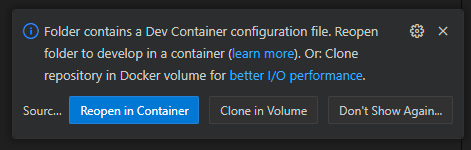
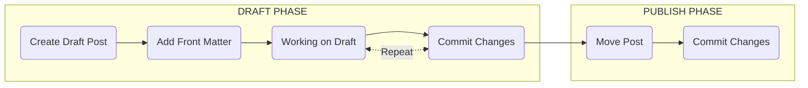

Welcome to Part 2 of the "Blog-as-Code" series. As a recap in the [previous post]()), we got the foundation of our site up and running with our personal flavour applied.

Today we are going to focus on the day-to-day aspect of how we will draft / publish new posts, and what I've learnt along the way that might make things easier for you (certainly has helped me... I may have spent the last few days down some rabbit holes trying different things).

# Okay so Dev Containers (or GitHub Codespaces), but why?

Okay so why am I talking about Dev Containers (or GitHub Codespaces), especially after telling you about how I use [VSCode for the Web](https://vscode.dev) to work with my GitHub repo / projects.

Well it all came about after tinkering with Jekyll and trying different methods for how I wanted to manage draft posts (as sometimes like this one it can take several days😁). And coming to the realisations that Dev Containers (or GitHub Codespaces) was "required" to achieve / resolve how I want to draft and publish posts to my site.

1. I don't want Jekyll generating static site files for posts I am still working on, and inadvertently publishing them to "production" (GitHub Pages)
2. I want to easily preview a "working" version of my site as I go, just like it would be on GitHub Pages. *Markdown Previews are great but not the same.*

> Also remember I'm a big fan of docker and how it can containerise / isolate services I host or might be working on, keeping the underlying system clean of things I maybe tinkering with. Simply delete the container and the software inside was like it was never there.
{: .prompt-info }

*Before I went down the rabbit hole of using Dev Containers (and that was a journey of 😣 and sudden 🙌 moments), I tried a few other concepts that Jekyll "supposible" supports but don't seem to work how I expected. This attempted to hide posts through Front Matter variables (more on those later). But as I quickly discovered they only hide the post from the main page, not other parts of the site like Archives or the Recently Update section (🤦‍♂️hardly keeping them hidden is it) or just not generating them at all!.*

> Front Matter is like meta data for your posts, it contains variables for all sorts of things, including options to make a post hidden or visible or published these all work in different ways, but not how I wanted:
- ```Hidden: true``` and ```visible: 1``` hides the post from the main page, but not those other areas of the site.
- ```Publish: false``` tells Jekyll site generator to skip these files. Unless you add the option ```--unpublished```. So you need to run a seperate generation and hosting process to view unpublished posts. *Similar to what I am actually doing with drafts (more on that later).*
{: .prompt-info }

## Developing inside a container

Dev Containers are a fully featured development environment within a docker container. It allows you to open any folder inside (or mounted into) a container and take advantage of (in this case) Visual Studio Code's full feature set, without littering your underlying system with different tools / programing frameworks.

> For more information about developing inside a container checkout the documentation from Visual Studio Code [here](https://code.visualstudio.com/docs/devcontainers/containers)
{: .prompt-tip }

> [**GitHub Codespaces**](https://github.com/features/codespaces) is a cloud hosted environment for running dev containers. **GitHub Free for personal** accounts get  15GB storage per month and 120 Core hours per month *(more information on [usage](https://docs.github.com/en/billing/managing-billing-for-github-codespaces/about-billing-for-github-codespaces#monthly-included-storage-and-core-hours-for-personal-accounts))* enough for most personal development needs.
{: .prompt-info }

### Setting up our Dev Container

So setting up our dev container is actually reasonable straight foward. We just need to create a definition file (```devcontainer.json```) that tells VSCode or Codespaces what our Dev Container is.

I am going to save you some time and provide a working example of the ```devcontainer.json``` I am using to develop my site in. I learnt a few lessons along the way and this should avoid you making those same mistakes.

> If you are going to run your Dev Containers locally like me, you need to make sure you meet the following [system requirements](https://code.visualstudio.com/docs/devcontainers/containers#_system-requirements)
{: .prompt-info }

```json
{
	"name": "Osotechie.com site",
	"image": "mcr.microsoft.com/devcontainers/jekyll:2-bullseye",

	"customizations": {
		"vscode": {
			"extensions": [
				"oderwat.indent-rainbow",
				"vscode-icons-team.vscode-icons",
				"bierner.markdown-mermaid",
				"GitHub.vscode-github-actions",
				"davidanson.vscode-markdownlin"
			]
		}
	},

	"postStartCommand": "bundle exec jekyll server --livereload --draft --incremental --force-polling",

	"remoteUser": "root"
}
```
{: file="/.devcontainer/devcontainer.json" }

Okay so lets breakdown the above file and talk about a few things I have learnt, or issues to avoid.

- ```"image": ``` defines the base docker image our dev container will be built from. This image includes everything we need to generate (and preview) our Jekyll based site.
- ```"customizations": { "vscode": { "extensions": [ ]	}``` defines the list of VSCode Extensions we want to add to our IDE inside the container. I have provided a list of several useful extensions I like to use.

- ```"postStartCommand": ``` defines commands to run once the container is started. In the above example the command is set so Jekyll generates and hosts a copy of our site.

  - ```"--livereload```" ensures Jekyll runs a livereload service that helps browsers automatically refresh 
  - ```"--draft```" tells Jekyll to generate the content in the _drafts folder (more on that later)
  - ```"--incremental```" tells Jekyll to monitor files for changes and regenerate the site with that new content
  - ```"--force-polling```" is a fix to ensure --incremental works on some systems, as sometimes the container does not get notified about file changes

- ```"remoteUser: "```"-- defines what user within the container you will be running things as. 

> Okay so these were the two main lessons learnt when I was building and testing my Dev Container.
1. Dont use the ```"PostCreateCommand"``` option, it causes an issue with the .gitconfig file being populated with your Git credentials from the local machine. *I spent far too long trying to solve this issue 😤*
2. There is a file ownership issues between Windows and Linux containers, that means that files in the repo somes have a owner of root. This file access issues (as by default the image runs under the user vscode), and also a warning that the repository is unsafe. Setting ```"remoteUser": "root"``` however ensures we are running as root and have access to everything.
{: .prompt-tip }

### Starting our Dev Container

1. Open VSCode
2. Clone Repo
3. Reopen in Container
	
	

4. 

5. 


# WORK IN PROGRESS


>But first I think its important you are familiar with the basics of [writing a new post](https://chirpy.cotes.page/posts/write-a-new-post/). And instead of me reguritating already great documentation, I think you should checkout Chirpy's documentation and come back here
{: .prompt-tip }

# New Post Workflow

Okay so with that out of the way lets run through the high-level flow for creating a new post:



* **DRAFT** - During the drafting phase I use a technique I will discuss shortly that allows me to work on posts, commit changes and review them in GitHub pages (whilst keeping them hidden). Writing a blog takes time (several days and many commits to get it right). Using this method allows me to easily save work in progress and see the changes live. Without having to run my special instance of Jekyll (more on that later).

* **PUBLISH** - Once I am happy with the post I update the Front Matter ready to Commit the final version making it public (visible).

## Front Matter

Example Front Matter DRAFT
- hidden: true
- no tags or categories

Example Front Matter PUBLISH
- hidden: true (removed)
- tags and categories added
