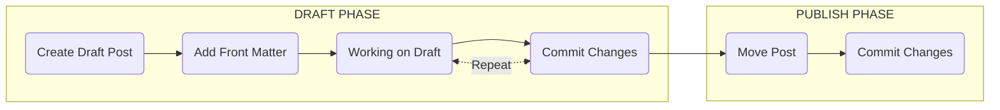

OMG So it was an issue with the devcontainer.json file

Welcome to Part 2 of the "Blog-as-Code" series. As a recap in the [previous post]()), we got the foundation of our site up and running with a bit of our personal flavour applied.

Today we are going to focus on the day-to-day aspect of how we will draft / publish new posts, and what I've learnt along the way that might make things easier for you (certainly has helped me).

>But first I think its important you are familiar with the basics of [writing a new post](https://chirpy.cotes.page/posts/write-a-new-post/). And instead of me reguritating already great documentation, I think you should checkout Chirpy's documentation and come back here
{: .prompt-tip }

# Visual Studio Code (VSCode)
Now before we dive into the process for drafting and then publishing a post. I wanted to expand on the tooling (IDE) I mentioned in Part 1. So for the most part I use [VSCode for the Web](https://vscode.dev) to work with my GitHub repo / projects. And to help make things even easier I also use / recommend the following Extensions:



1. The Basics
  - Text and Typography
    - https://chirpy.cotes.page/posts/text-and-typography/
    - https://github.com/cotes2020/jekyll-theme-chirpy/blob/master/_posts/2019-08-08-text-and-typography.md
    - https://chirpy.cotes.page/posts/write-a-new-post/
1. New Post Workflow
2. Advanced Post Feautes
  - linking to other posts
  - mermaid diagrams
  - includes
3. Add Commenting Support

# New Post Workflow

Okay so with that out of the way lets run through the high-level flow for creating a new post:

* **DRAFT** - During the drafting phase I use a technique I will discuss shortly that allows me to work on posts, commit changes and review them in GitHub pages (whilst keeping them hidden). Writing a blog takes time (several days and many commits to get it right). Using this method allows me to easily save work in progress and see the changes live. Without having to run my special instance of Jekyll (more on that later).

* **PUBLISH** - Once I am happy with the post I update the Front Matter ready to Commit the final version making it public (visible).

## Front Matter

Example Front Matter DRAFT
- hidden: true
- no tags or categories

Example Front Matter PUBLISH
- hidden: true (removed)
- tags and categories added
