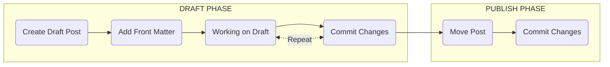

# WORK IN PROGRESS

>But first I think its important you are familiar with the basics of [writing a new post](https://chirpy.cotes.page/posts/write-a-new-post/). And instead of me reguritating already great documentation, I think you should checkout Chirpy's documentation and come back here
{: .prompt-tip }

# New Post Workflow

Okay so with that out of the way lets run through the high-level flow for creating a new post:

* **DRAFT** - During the drafting phase I use a technique I will discuss shortly that allows me to work on posts, commit changes and review them in GitHub pages (whilst keeping them hidden). Writing a blog takes time (several days and many commits to get it right). Using this method allows me to easily save work in progress and see the changes live. Without having to run my special instance of Jekyll (more on that later).

* **PUBLISH** - Once I am happy with the post I update the Front Matter ready to Commit the final version making it public (visible).

## Front Matter

Example Front Matter DRAFT
- hidden: true
- no tags or categories

Example Front Matter PUBLISH
- hidden: true (removed)
- tags and categories added